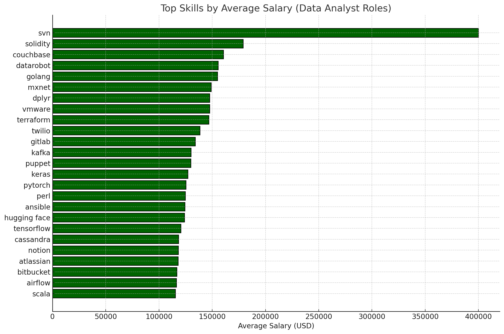
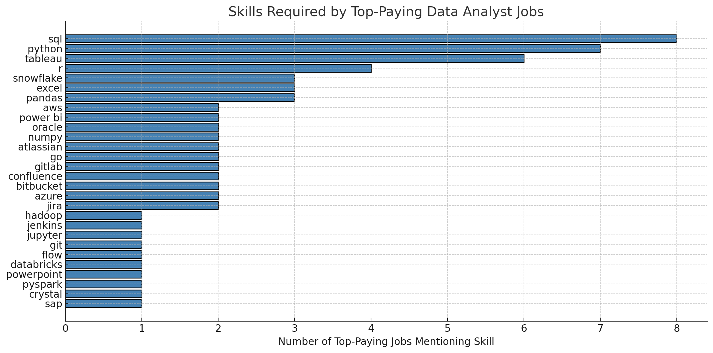

# SQL Job Market Analysis: Skills, Demand & Salaries

This project explores the data analyst job market using SQL to answer real-world career questions: Which skills are in demand? Which jobs pay the most? And which tools are worth learning for long-term growth?

By querying a structured job postings dataset, I analyzed patterns in salaries, role types, and required skills to extract actionable insights for aspiring or transitioning data professionals.

---

## 📌 Introduction

In a fast-evolving data industry, staying competitive means choosing the right tools to learn—and understanding what employers are really looking for. This analysis focuses on answering five key questions about the data analyst job market:

1. What are the top skills based on salary?
2. What are the top-paying data analyst jobs?
3. What are the top-paying data analyst jobs and what skills do they require?
4. What are the most in-demand skills for data analysts?
5. What are the most optimal skills to learn (high demand + high pay)?

---

## 🛠 Tools Used

- **SQL**: Used extensively to query, join, clean, and analyze relational job postings data. All insights were derived from SQL-based exploration.

- **PostgreSQL**:
Served as the database management system (DBMS) for storing and querying the dataset. Its robust support for complex joins and aggregations made it ideal for analysis.

- **Visual Studio Code**:
The main code editor for writing, debugging, and iterating on SQL queries. Paired with SQL extensions to streamline workflow.

- **Git & GitHub**:
Used for version control, collaboration, and documentation. Tracked iterations of SQL files and enabled clean project sharing.

---

## 🔍 1. Top Skills Based on Salary

📄 [View SQL](project_sql/top_paying_skills.sql)

To identify the highest-paying skills for data analysts, I joined job postings with associated skills and calculated the average salary per skill.

**Top results:**

| Skill         | Avg Salary (USD) |
|---------------|-----------------:|
| SVN           | $400,000.00      |
| Solidity      | $179,000.00      |
| Couchbase     | $160,515.00      |
| DataRobot     | $155,485.50      |
| Golang        | $155,000.00      |

**Observation:**  
 - The skill SVN shows an unusually high average salary of $400,000, likely due to data outliers or mislabeling.
 - Other high-paying skills include Solidity, Couchbase, DataRobot, and Golang, each associated with salaries above $150,000.
- Many of these are not core analytics tools, but rather technologies used in engineering, DevOps, or machine learning infrastructure.

**Insights:**  
 - Candidates aiming for higher compensation may benefit from exploring engineering-adjacent tools such as Golang or DataRobot, though these are more common in hybrid or specialized roles.
 - These tools tend to appear less frequently in job postings, suggesting high salary potential but limited demand.
 - Aspiring analysts should prioritize foundational tools first before pursuing niche platforms that require prior technical experience.

---

## 💼 2. Top-Paying Data Analyst Jobs

📄 [View SQL](project_sql/top_paying_jobs.sql)

This query identifies the **top 10 highest-paying remote** data analyst roles.

**Top jobs:**

| Job Title                           | Company       | Salary     |
|------------------------------------|---------------|-----------:|
| Data Analyst                       | Mantys        | $650,000   |
| Director of Analytics              | Meta          | $336,500   |
| Associate Director – Data Insights| AT&T          | $255,829   |
| Data Analyst, Marketing            | Pinterest     | $232,423   |
| Data Analyst (Hybrid/Remote)       | UCLA Health   | $217,000   |

**Observation:**  
 - The highest listed salary is $650,000 for a “Data Analyst” role at Mantys, which appears to be an outlier.
 - Excluding that, the top-paying roles (>$200K) are primarily senior-level positions such as Director or Principal at Meta, AT&T, and Pinterest.
 - All roles are remote or hybrid, indicating that geographic flexibility does not constrain compensation.

**Insights:**  
 - Progression to Director-level or Principal-level titles is strongly correlated with higher pay in data analytics.
 - Job seekers should focus on building experience in cross-functional collaboration, stakeholder communication, and strategic impact to access these roles.
 - Remote flexibility remains available even at high compensation tiers, but employers may expect greater autonomy and leadership maturity in return.

---

## 🧠 3. Skills Required by Top-Paying Jobs

📄 [View SQL](project_sql/top_paying_job_skills.sql)

By combining salary data with skills data, I mapped out what skill sets are associated with the top-paying roles.

**Observation:**  
 - Core skills such as SQL, Python, and Tableau appear consistently across all top-paying roles.
 - Tools related to cloud platforms (Snowflake, Databricks, Azure, AWS) and team collaboration (Jira, Confluence, GitLab) also appear frequently.
 - These roles reflect expectations beyond technical proficiency, including familiarity with modern data platforms and agile workflows.

**Insights:**  
 - A well-rounded skill set including SQL, Python, and one data visualization tool (e.g., Tableau or Power BI) forms the baseline for high-paying roles.
 - Familiarity with cloud data platforms and pipeline tools can significantly improve competitiveness for senior or hybrid analyst roles.
 - Employers hiring for top-paying analyst roles often prioritize candidates who are comfortable operating in collaborative, cross-functional environments.

---

## 📈 4. Most In-Demand Skills

📄 [View SQL](project_sql/top_demanded_skills.sql)

This query counts how often each skill appears in data analyst job postings.

**Most in-demand skills:**

| Skill     | Demand Count |
|-----------|-------------:|
| SQL       | 92,628       |
| Excel     | 67,031       |
| Python    | 57,326       |
| Tableau   | 46,554       |
| Power BI  | 39,468       |

**Observation:**  
 - SQL appears in over 92,000 data analyst job postings—far exceeding all other skills.
 - Other high-frequency tools include Excel, Python, Tableau, and Power BI.
 - These tools are consistently requested across a wide range of industries and job levels.

**Insights:**  
 - Entry-level candidates should prioritize learning SQL, Excel, and Python, as these are foundational to nearly all analyst roles.
 - Proficiency in at least one BI tool (e.g., Tableau or Power BI) is also highly recommended.
 - These core tools offer the widest access to job opportunities and are commonly used in both technical and business-facing contexts.

---

## 🎯 5. Optimal Skills to Learn

📄 [View SQL](project_sql/optimal_skills.sql)

This query combines salary and frequency to identify **high-value skills**—those that are both in demand and linked to higher pay.

**Top high-pay, high-demand skills:**

| Skill       | Demand Count | Avg Salary (USD) |
|-------------|--------------|------------------:|
| Kafka       | 40           | $129,999          |
| PyTorch     | 20           | $125,226          |
| Airflow     | 71           | $116,387          |
| Scala       | 59           | $115,480          |
| GCP         | 78           | $113,065          |
| Spark       | 187          | $113,001          |
| Databricks  | 102          | $112,880          |
| Snowflake   | 241          | $111,578          |
| Hadoop      | 140          | $110,888          |
| Pandas      | 90           | $110,767          |

**Observation:**  
 - Skills such as Snowflake, Databricks, Spark, and GCP show both high demand (70–240 job listings) and high average salaries ($110K+).
 - Tools like Kafka, PyTorch, and Airflow are associated with even higher salaries but appear in fewer postings.
 - This indicates a distinction between broadly useful “power tools” and highly specialized, high-paying technologies.

**Insights:**  
 - Professionals with a strong foundation in SQL and Python may consider learning Snowflake, Databricks, or Spark to increase their value in data engineering or advanced analytics teams.
 - Tools such as Kafka and Airflow are ideal for those pursuing ML pipeline or automation-heavy roles, though demand is narrower.
 - Specializing in one high-salary, in-demand skill and applying it in real-world contexts can help candidates differentiate themselves in competitive markets.

---

## ✅ Conclusion

This project offered more than just insights into the data analyst job market—it sharpened my ability to ask the right questions, write efficient SQL queries, and interpret real-world data in a meaningful way.

From the analysis, several patterns became clear:

- SQL is non-negotiable across roles, industries, and salary brackets. It’s the foundational language that unlocks most analyst opportunities.

- Excel, Python, Tableau, and Power BI remain staples, showing that well-rounded proficiency—not just flashy skills—drives market demand.

- Top-paying jobs are concentrated among senior titles and hybrid analyst-engineer roles, where cloud platforms, workflow orchestration tools (like Airflow), and collaboration platforms (e.g., GitLab, Confluence) play a growing role.

- Niche tools like Kafka and PyTorch offer high salary potential but are often tied to specialized or leadership roles.

### Closing Thoughts

This project deepened not just my SQL proficiency, but also my ability to think critically with data. I learned how to clean, join, and aggregate multiple tables to surface patterns in hiring, skills demand, and compensation trends. Along the way, I also saw how issues—like inconsistent skill naming or missing salary values—can significantly shape the outcome of an analysis.

Ultimately, I learned that it’s not about how much I know about SQL syntax. What matters more is asking the right questions and figuring out how best to represent the data at hand. Insightful analysis isn’t just technical—it's intentional.

